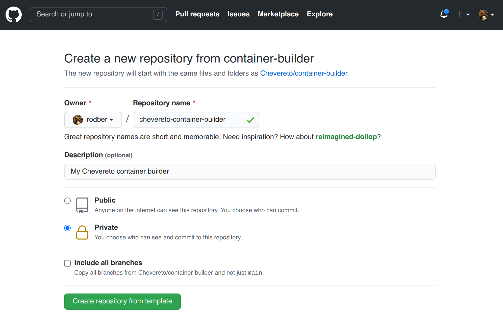

# Setup

* Click the [Use this template](https://github.com/chevereto/docker-builder/generate) button

A prompt like this will appear, we recommend using a private repo.

1. Go to **Secrets** under **Settings** from your new repo
2. Click on **New repository secret**
3. Provide the following repository **secrets**:

| Key               | Description                             |
| ----------------- | --------------------------------------- |
| CHEVERETO_LICENSE | Chevereto license key (*)               |
| REGISTRY_IMAGE    | `owner/chevereto-build`                 |
| REGISTRY_LABEL    | `ghcr.io/owner`, `docker.io`, `quay.io` |
| REGISTRY_PASSWORD | Registry password                       |
| REGISTRY_USERNAME | Registry username                       |

This repo uses RedHat Actions [buildah-build](https://github.com/redhat-actions/buildah-build), [podman-login](https://github.com/redhat-actions/podman-login) and [push-to-registry](https://github.com/redhat-actions/push-to-registry).

## Custom application

By default this repository uses your Chevereto license to download the latest Chevereto release. By adding the the following repository secrets you can use your own custom application:

| Key                   | Description                              |
| --------------------- | ---------------------------------------- |
| REPO_APP              | `owner/repo`                             |
| REPO_APP_ACCESS_TOKEN | Personal Access Token for the repo above |

You can also put the contents of your custom Chevereto based application in the `/chevereto` folder before building the image.

## Manual setup

Refer to the [CONSOLE GUIDE](guides/console/SETUP.md).
