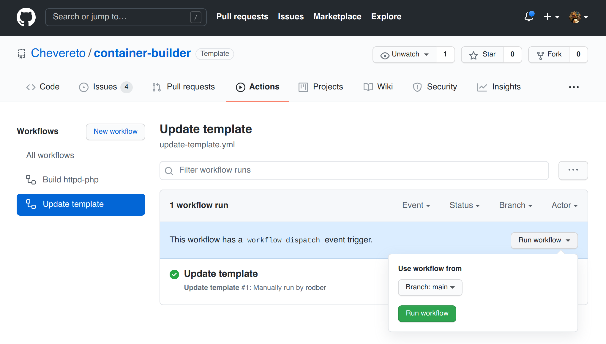

# Repository syncing

Repository updating is required to keep your local project in sync with this repository. This is required to keep your project up-to-date with the latest changes and improvements, new branches, etc.

To update this repository make sure to stop all instances by running the following command.

```sh
make down NAMESPACE=yourproject
```

Once done, run this to update the repository.

```sh
make sync
```

If needed, switch to the new branch/tag.

```sh
git switch 4.2
```

## Manual repo updating

Pull changes in your local copy of this repo.

```sh
git fetch --tags -f && git pull --rebase --autostash
```

Then switch to the new branch/tag if needed.

```sh
git switch 4.2
```

## GitHub one-click repo updating

1. Go to **Actions**
2. Select **Update** under **Workflows**
3. Click on **Run Workflow** and confirm



🤖 When done **a bot will create a pull request** in your repo so you can review and confirm the changes.


